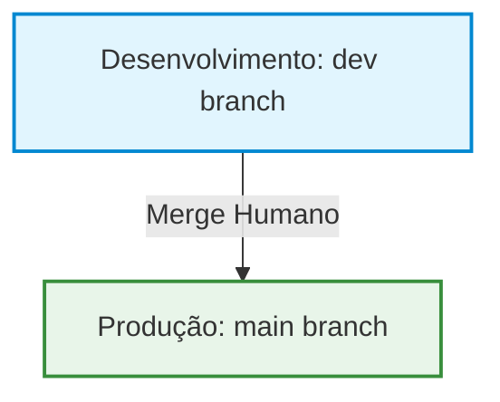

# Contexto do Projeto: Orgulho da Nutri

Este documento descreve as decisões de arquitetura, fluxo de trabalho e o pipeline de CI/CD para o projeto.

---

## 🔄 Fluxo de Desenvolvimento e Deploy (Git Flow)

Para garantir a integridade do código e a estabilidade dos dados em produção, o projeto adota um fluxo de branches estruturado com CI/CD automatizado via Vercel:



### 1. Desenvolvimento (Branch `dev`)
- **Atores:** Agente de IA e Desenvolvedor Humano.
- **Objetivo:** Criação de novas features, correções de bugs, refatorações e automações.
- **Ambiente:** Execução e testes em ambiente local.
- **CI/CD:** A Vercel intercepta commits na branch `dev` e gera um **Preview Deployment** apontando para um banco de dados de homologação/preview.
- > [!IMPORTANT]
  > O agente de IA atua **exclusivamente** nesta branch. Qualquer alteração ou commit deve ser feito apenas em `dev`.

### 2. Produção (Branch `main`)
- **Atores:** Apenas o Desenvolvedor Humano.
- **Objetivo:** Disponibilização pública das funcionalidades validadas.
- **Fluxo:** Após a homologação e validação no preview (`dev`), o desenvolvedor humano realiza o merge de `dev` para `main` e envia para o GitHub.
- **CI/CD:** A Vercel realiza o deploy final de produção acessível para os usuários finais.

---

## 🛠️ Regras de Versionamento e Commit
- Todo commit deve passar na validação local:
  ```bash
  npm run validate
  ```
- O padrão de mensagens de commit segue o **Conventional Commits**:
  - `feat(...)`: Novas features ou páginas.
  - `fix(...)`: Correção de bugs.
  - `refactor(...)`: Alterações de código que não mudam comportamento.
  - `chore(...)`: Mudanças de pacotes, configurações e builds.
